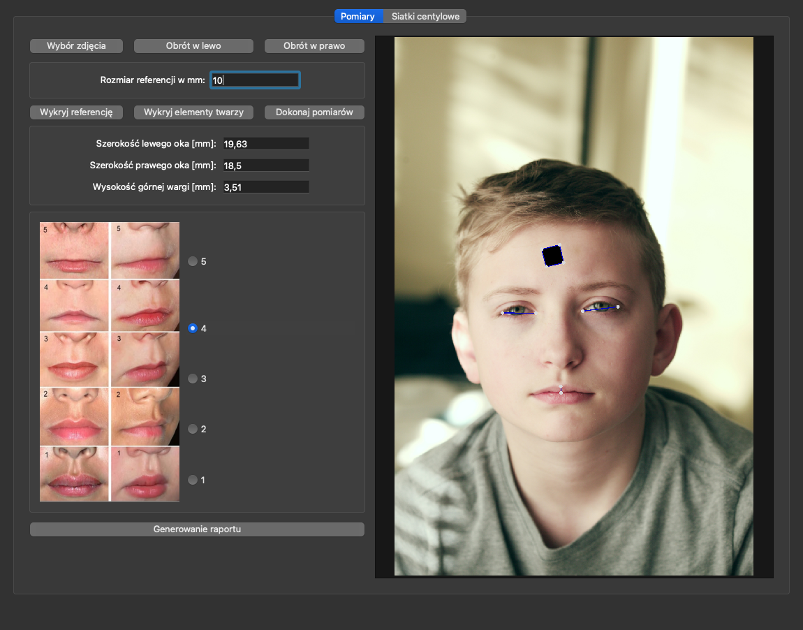
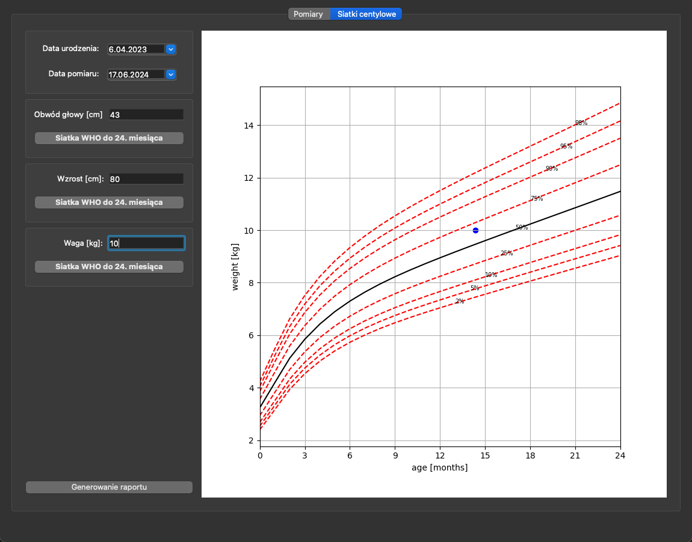

# FAS Detection Support Tool

## About

The app is designed to assist doctors and healthcare professionals in diagnosing FAS (Fetal Alcohol Syndrome). It consists of a tool allowing detection and measurement of specific facial features associated with FAS, providing fast and accurate results and a printable PDF report.

Additionally, the application can generate centile charts according to WHO standards for other features and also save them in a report.

## Features

- **Facial Feature Detection**: automatically detects facial features using Google's Mediapipe tool
- **Measurement**: measures detected features to allow doctors to use the measurements in diagnostics
- **Report Generation**: generates comprehensive reports
- **Centile Charts**: generates centile charts according to WHO standards for additional patient's features
- **User-Friendly Interface**: intuitive and simple interface that can be easily navigated by users

## Measurements

To ensure accurate measurement and scaling of facial features, the application requires a black square of known dimensions to be included in the image as a reference. This square allows the tool to calibrate and scale the measurements correctly. In an example below, the reference is a sticker on child's forehead.

## Centile charts

## System Requirements

- Python 3.11+